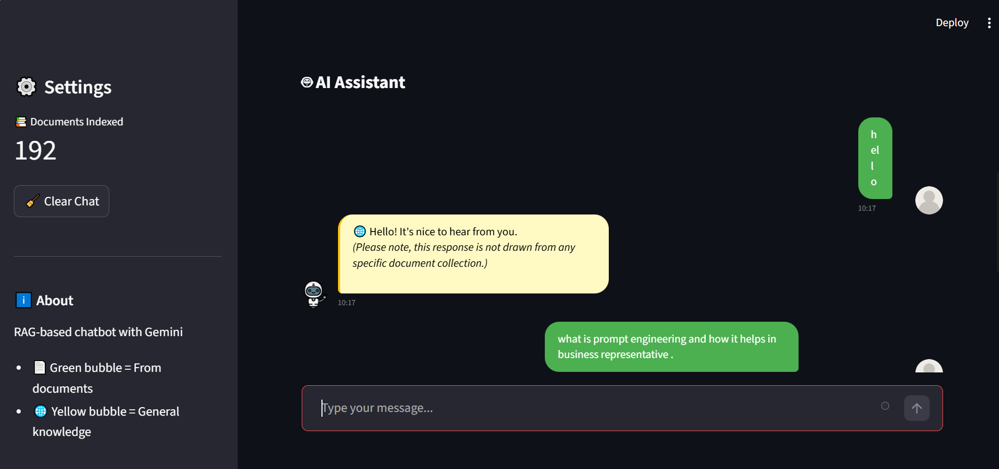
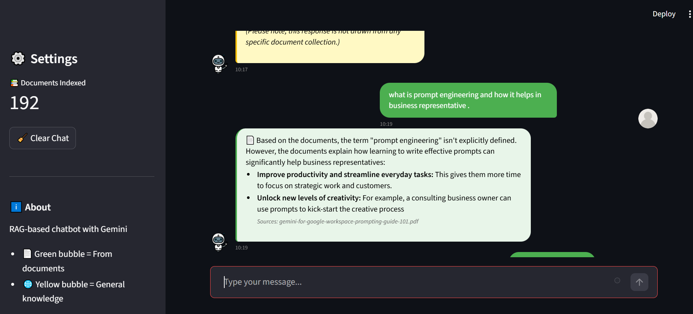
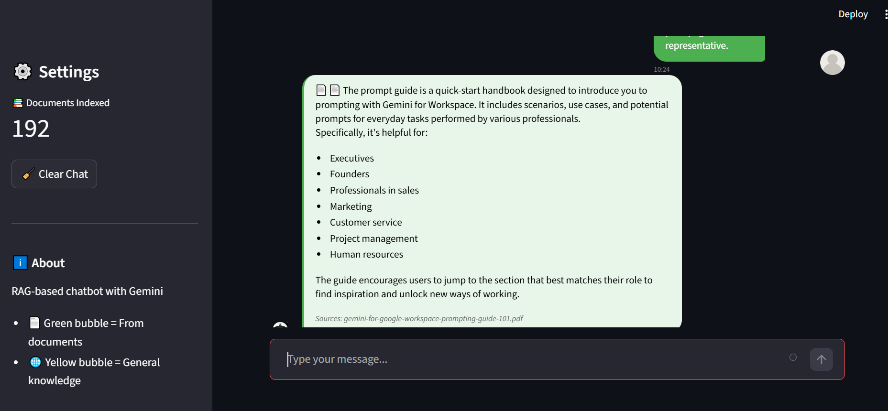

# Context-Aware Chatbot Using RAG

A Retrieval-Augmented Generation (RAG) chatbot designed for students and beginners learning AI and technical subjects. The system provides document-driven conversational assistance with clear distinction between document-based and general knowledge responses.

## Features

- **Document-First Retrieval**: Prioritizes answers from your document collection
- **Controlled LLM Fallback**: Gracefully handles out-of-scope queries with clear indicators
- **Context-Aware Conversations**: Maintains conversation history across multiple turns
- **Premium Chat UI**: Modern bubble-style interface with timestamps and avatars
- **Clear Response Indicators**: 
  - 📄 Green bubble = Answer from documents
  - 🌐 Yellow bubble = General knowledge response
- **Fast Performance**: Target response time <3 seconds
- **Simple Setup**: CPU-only, no GPU required

## Technology Stack

- **Embeddings**: sentence-transformers/all-MiniLM-L6-v2 (local, offline)
- **Vector Store**: FAISS (CPU-optimized)
- **LLM**: Google Gemini API (free-tier)
- **UI**: Streamlit
- **Document Processing**: PyPDF, LangChain

## Quick Start

### 1. Installation

```bash
# Clone or navigate to the project directory
cd Context_Aware_Chatbot

# Install dependencies
pip install -r requirements.txt
```

### 2. Setup

```bash
# Create .env file with your Gemini API key
echo "GEMINI_API_KEY=your_api_key_here" > .env

# Add your documents to the data directory
# Supported formats: PDF, TXT, MD
mkdir -p data
# Copy your documents to data/
```

### 3. Prepare Knowledge Base

```bash
# Process documents and create vector index
python data_prep.py
```

This will:
- Load all documents from `data/` directory
- Split them into 500-character chunks with 50-character overlap
- Generate embeddings using sentence-transformers
- Create FAISS index for fast retrieval

### 4. Run the Application

```bash
# Start Streamlit app
streamlit run app.py
```

The app will open in your browser at `http://localhost:8501`

## Usage

1. **Ask Questions**: Type your question in the chat input
2. **View Responses**: 
   - Green bubbles (📄) are based on your documents with source attribution
   - Yellow bubbles (🌐) are general knowledge when documents don't contain the answer
3. **Follow-up Questions**: The chatbot maintains context for natural conversations
4. **Clear History**: Use the "🧹 Clear Chat" button in the sidebar to start fresh
5. **View Stats**: Check the sidebar for document count and system information

## Project Structure

```
Context_Aware_Chatbot/
├── data/                  # Your documents (PDFs, text files) - create this directory
├── vector_db/             # FAISS index and metadata - auto-generated
├── .gitignore             # Git ignore rules
├── app.py                 # Main Streamlit application with premium UI
├── data_prep.py           # Document processing and indexing pipeline
├── requirements.txt       # Python dependencies
├── .env                   # API keys (create this file)
└── README.md              # This file
```

**Note**: Only core files are tracked in the repository. You'll need to create:
- `data/` directory for your documents
- `.env` file with your Gemini API key
- `vector_db/` will be auto-generated when you run `data_prep.py`

## Testing

The repository includes core functionality only. For testing:
- Verify the setup by running `python data_prep.py` after adding documents
- Test the application by running `streamlit run app.py`
- Manually test with various queries to validate retrieval and generation

## Demo





## Configuration

### Retrieval Settings

Edit `app.py` to adjust:
- `similarity_threshold`: 0.5-0.7 (default: 0.5)
- `top_k`: Number of chunks to retrieve (default: 3)

### Conversation Memory

- Maintains last 7 conversation turns
- Token limit: ~1000-1500 tokens
- Session-only (clears on restart)

### Chunking Strategy

Edit `data_prep.py` to adjust:
- `chunk_size`: 500 characters (default)
- `chunk_overlap`: 50 characters (default)

## Troubleshooting

### "FAISS index not found"
Run `python data_prep.py` to create the index first.

### "GEMINI_API_KEY not found"
Create a `.env` file with your API key:
```bash
GEMINI_API_KEY=your_key_here
```

### "No documents found"
Add PDF, TXT, or MD files to the `data/` directory.

### Slow performance
- Reduce `chunk_size` in data_prep.py
- Ensure you're using `faiss-cpu` (not `faiss-gpu`)
- Check your internet connection (for Gemini API calls)

### Poor retrieval quality
- Adjust `similarity_threshold` in app.py (try 0.6 or 0.7)
- Add more relevant documents to your knowledge base
- Ensure documents are well-formatted and readable

## API Key Setup

Get a free Gemini API key:
1. Visit [Google AI Studio](https://makersuite.google.com/app/apikey)
2. Create a new API key
3. Add it to your `.env` file

## Limitations

- CPU-only (no GPU acceleration)
- Session-based memory (no persistence across restarts)
- Free-tier API rate limits apply
- Best for datasets <10,000 document chunks

## Development Timeline

This project was designed for a 2-day development timeline:
- **Day 1**: Foundation, document processing, RAG engine
- **Day 2**: UI, testing, documentation

## Contributing

This is an educational project demonstrating RAG implementation. Feel free to:
- Add support for more document types
- Implement conversation persistence
- Add more sophisticated chunking strategies
- Improve UI/UX

## License

MIT License - See LICENSE file for details

## Support

For issues or questions:
1. Check the troubleshooting section above
2. Ensure all setup steps are completed correctly
3. Verify your `.env` file contains a valid Gemini API key
4. Check the CLAUDE.md file for implementation details

## Acknowledgments

Built with:
- [Sentence Transformers](https://www.sbert.net/)
- [FAISS](https://github.com/facebookresearch/faiss)
- [Google Gemini](https://ai.google.dev/)
- [Streamlit](https://streamlit.io/)
- [LangChain](https://www.langchain.com/)
